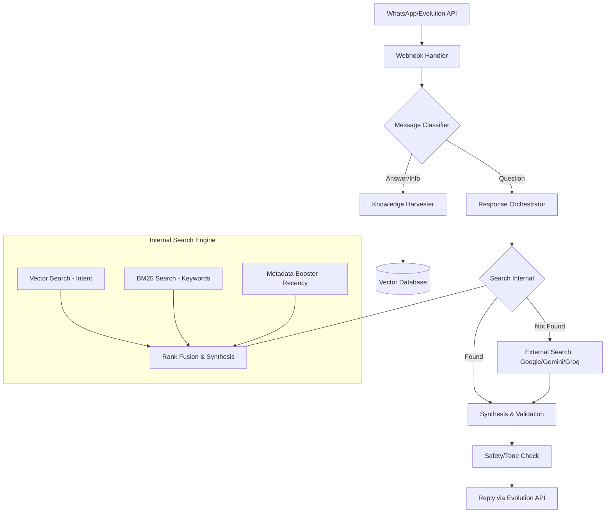

# Design: Knowledge Preservation System (KPS)

## 1. High-Level Architecture

The KPS is a **standalone microservice** (`knowledge-service`) that provides a RAG (Retrieval-Augmented Generation) API to the rest of the SocietyOps ecosystem.

## 2. Component Details

### 2.1 Message Classifier (LLM Powered)
- **Role:** Determine the intent of every incoming message.
- **Intents:** 
    - `QUERY`: Looking for info.
    - `FACT`: Providing info (e.g., "The electrician's number is X").
    - `CHAT`: Casual talk (discard).
- **Tooling:** Gemini 1.5 Flash (for speed and low cost).

### 2.2 Knowledge Harvester & Search (The Hybrid Engine)
- **Hybrid Retrieval Pipeline:**
    - **Vector Search:** Handles semantic similarity (e.g., "water leak" vs "pipe burst").
    - **BM25 Search:** Handles exact term matching (e.g., "Airtel" or specific flat numbers).
    - **Rank Fusion:** Combines results using Reciprocal Rank Fusion (RRF) to normalize different scoring scales.
- **Metadata Boosting:** 
    - Automatically adds `timestamp` and `category` to every knowledge item.
    - Queries use a decay function or direct boost to prioritize information added in the last 7-30 days for time-sensitive queries.
- **Storage:** PostgreSQL with PGVector for vectors + standard indexing for BM25.

### 2.3 Response Orchestrator (Agentic Tools)
- **Tool-Based Interaction:** The orchestrator uses LLM-driven "Tools" for interaction:
    - `search_knowledge_base(query)`: Performs the hybrid search.
    - `save_resolution(summary)`: Formats and stores new knowledge.
- **Wait Strategy:** Uses a Redis-based delay queue. If a human answers the question within 15 minutes, the bot's task is cancelled.
- **RAG (Retrieval Augmented Generation):** 
    1.  Search Vector DB for similar past questions/answers.
    2.  If confidence is low, trigger external search APIs.
- **Synthesis:** LLM combines internal facts and external search results into a cohesive answer.

### 2.4 Safety & Validation Layer
- **Input:** Generated Answer + Original Question + Community Context.
- **Validation Rules:**
    - Is it respectful?
    - Does it avoid sensitive topics?
    - Is the information verified? (e.g., if it's a phone number, check if it matches known formats).
- **Tone:** Set to "Helpful Neighbor" — friendly, concise, and non-authoritative.

## 3. Tech Stack
- **Database:** PostgreSQL (Metadata) + ChromaDB/PGVector (Embeddings).
- **LLMs:** 
    - **Gemini 1.5 Pro:** For complex synthesis and validation.
    - **Groq (Llama 3):** For fast initial classification.
- **Search API:** Serper.dev or Google Custom Search API.
- **Backend:** Standalone FastAPI service in `knowledge-service/`.
- **API Communication:** JSON over HTTP (internal Docker network).

## 4. Data Flow: "The Knowledge Loop"
1.  **Capture:** User A posts "The garbage pickup is at 8 AM daily."
2.  **Store:** System classifies as `FACT`, embeds it, and stores it.
3.  **Request:** User B (3 weeks later) posts "When does the trash get picked up?"
4.  **Wait:** System waits 15 mins. No one answers.
5.  **Retrieve:** System finds User A's post via semantic search.
6.  **Reply:** "Hi! Based on previous discussions, the garbage pickup is usually at 8 AM daily. Hope this helps! 🙏"
